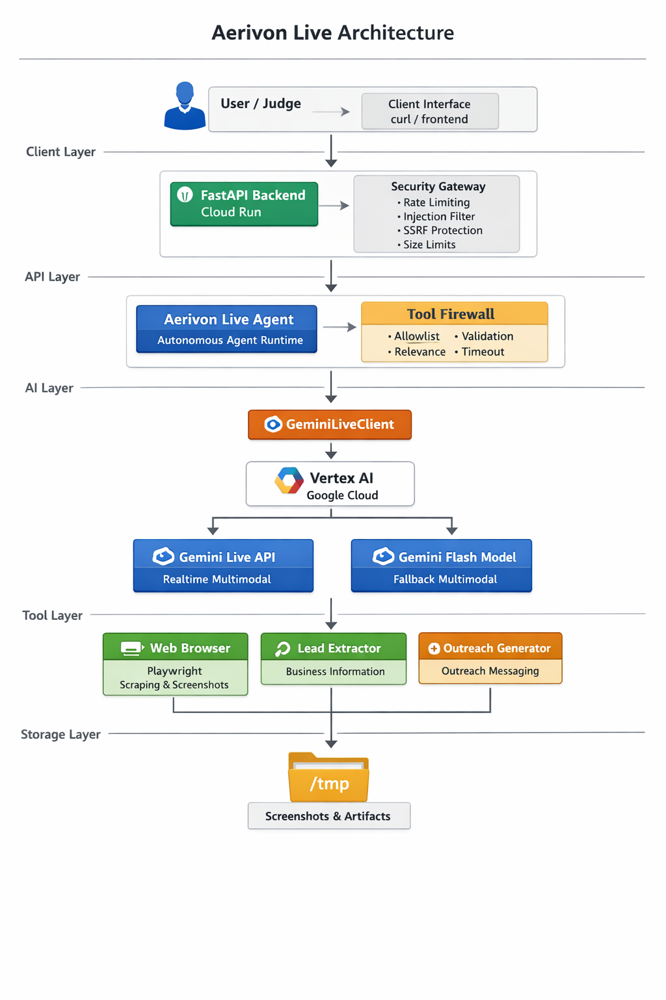

# Aerivon-Live

Secure autonomous Gemini-powered business agent backend (FastAPI) designed for hackathon demos and Cloud Run deployment.

## Architecture Diagram



## What this is

Aerivon Live is an autonomous agent runtime that can browse sites (Playwright), scrape leads, and generate outreach messages using Gemini on Vertex AI.

Key features:

- Vertex AI auth via ADC
- Gemini Live availability detection + automatic fallback to standard Gemini Flash when Live isn’t enabled
- Tool calling with allowlist, relevance gating, arg validation, SSRF protection
- Prompt-injection hardening (API + agent + model instruction)
- Cost controls (timeout, tool-call cap) + API limits (rate limit, size caps, bounded session memory)

## Submission docs
- Project writeup: [SUBMISSION.md](SUBMISSION.md)
- Demo checklist: [DEMO_CHECKLIST.md](DEMO_CHECKLIST.md)

## Run locally

One-command dev runner:

```bash
./aerivon
```

### Persistent memory (GCS)

Optional: persist per-user memory across reconnects by setting a GCS bucket.

```bash
export AERIVON_MEMORY_BUCKET="your-gcs-bucket"
```

The backend will read/write `gs://$AERIVON_MEMORY_BUCKET/memory/<user_id>.json`.

Create a bucket (example):

```bash
gcloud storage buckets create gs://YOUR_BUCKET \
  --project aerivon-live-agent \
  --location us-central1 \
  --uniform-bucket-level-access
```

The runtime identity (your local ADC or service account) needs `storage.objects.get` and
`storage.objects.create` on that bucket (e.g. `roles/storage.objectAdmin`).

Manual backend run (optional):

```bash
cd backend

export GOOGLE_CLOUD_PROJECT="aerivon-live-agent"
export GOOGLE_CLOUD_LOCATION="us-central1"

uvicorn server:app --reload --app-dir . --host 127.0.0.1 --port 8080
```

## Judge / demo endpoints

```bash
curl http://localhost:8080/health
curl http://localhost:8080/agent/startup-check
curl http://localhost:8080/agent/security-check
curl http://localhost:8080/agent/self-test
curl http://localhost:8080/agent/architecture

# Streaming (SSE)

curl -N -X POST http://localhost:8080/agent/message-stream \
  -H "Content-Type: application/json" \
  -d '{"user_id":"demo","message":"Say hello in 3 short chunks."}'

# Real-time (Live Agents)

Aerivon Live exposes a real-time WebSocket for Live Agents demos:

- WS: `ws://localhost:8080/ws/live`
- Supports interruption via `{ "type": "interrupt" }`

Optional query params:

- `?output=text` (default) or `?output=audio` (Live audio output + transcription)
- `?voice=VOICE_NAME&lang=en-US` (voice selection; must be set at session start)

Message formats:

- Text: `{ "type": "text", "text": "..." }`
- Audio chunk: `{ "type": "audio", "mime_type": "audio/wav", "data_b64": "..." }`
- Audio end: `{ "type": "audio_end" }`
- Image frame: `{ "type": "image", "mime_type": "image/png", "data_b64": "..." }`

Server streams:

- `{ "type": "text", "text": "..." }`
- `{ "type": "audio", "mime_type": "audio/pcm", "data_b64": "..." }` (when `output=audio`)
- `{ "type": "transcript", "text": "...", "finished": false }` (when `output=audio`)
- `{ "type": "interrupted" }`
- `{ "type": "turn_complete" }`

Tip: keep audio chunks small (e.g. 50–200KB base64 per frame).

### Persistent memory (Firestore)

If you prefer Firestore for per-user conversation memory, set:

```bash
export AERIVON_FIRESTORE_COLLECTION="aerivon_memory"
```

When `AERIVON_FIRESTORE_COLLECTION` is set it takes precedence over `AERIVON_MEMORY_BUCKET`.

### Realtime vision model

If your project has a specific vision-capable Live model, set:

`GEMINI_LIVE_VISION_MODEL="..."`

Aerivon will probe candidates and report the selected `model` + `vision` flag in the initial WS `status` message.
```

## Demo request

```bash
curl -X POST http://localhost:8080/agent/message \
  -H "Content-Type: application/json" \
  -d '{"message":"Find 3 dentists in Miami and generate outreach messages"}'

## Audio output (TTS)

Generate an MP3 response using Google Cloud Text-to-Speech:

```bash
curl -sS -X POST http://localhost:8080/agent/speak \
  -H "Content-Type: application/json" \
  -d '{"text":"Hello from Aerivon Live"}' \
  -o /tmp/aerivon_tts.mp3
```
```

## Cloud Run deploy

```bash
gcloud run deploy aerivon-live-agent \
  --source backend \
  --region us-central1 \
  --allow-unauthenticated \
  --memory 512Mi \
  --cpu 1 \
  --timeout 60 \
  --max-instances 2
```

## Cloud Run (host frontend too)

Deploy backend (already in this repo):

```bash
SERVICE_NAME=aerivon-live-agent REGION=us-central1 PROJECT_ID=aerivon-live-agent \
  SERVICE_ACCOUNT=aerivon-live-run@aerivon-live-agent.iam.gserviceaccount.com \
  GOOGLE_CLOUD_LOCATION=us-central1 \
  AERIVON_MEMORY_BUCKET=aerivon-live-agent-memory-1771792693 \
  scripts/deploy_cloud_run.sh
```

Deploy frontend (Cloud Run) and point it at the backend:

```bash
BACKEND_URL=$(gcloud run services describe aerivon-live-agent --region us-central1 --format='value(status.url)')
gcloud run deploy aerivon-live-frontend \
  --project aerivon-live-agent \
  --region us-central1 \
  --source frontend \
  --allow-unauthenticated \
  --set-env-vars "AERIVON_BACKEND_BASE=$BACKEND_URL"
```

## Automated cloud deployment (bonus)

This repo includes automation artifacts you can link in your submission:

- Scripted Cloud Run deploy: [scripts/deploy_cloud_run.sh](scripts/deploy_cloud_run.sh)
- Cloud Build (IaC-style) deploy config: [cloudbuild.yaml](cloudbuild.yaml)

## Notes

- Live models may not be enabled in all projects/regions; Aerivon Live will automatically fall back.
- Scraping respects robots.txt; a robots block is expected on some sources.
