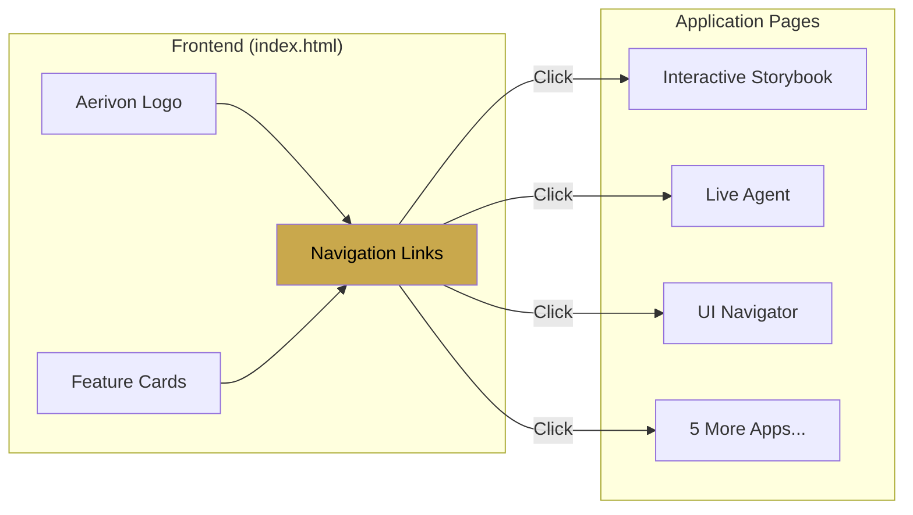
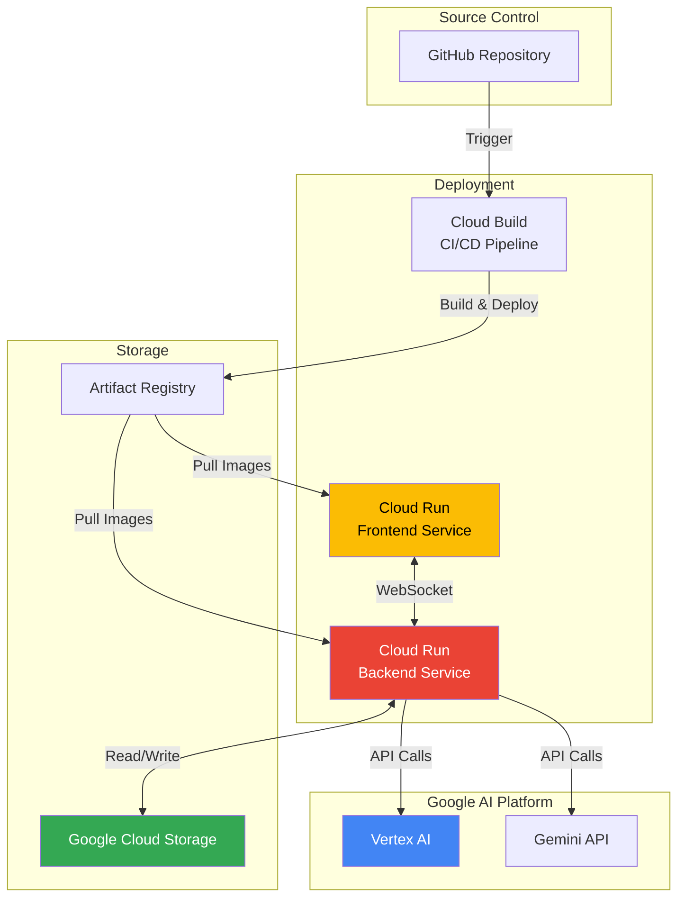

# Aerivon Live - Architecture Diagrams

This document contains Mermaid diagrams for each feature group. These can be rendered as PNG images for documentation.

---

## 1. Interactive Storybook Architecture

**Pages:** story.html

```mermaid
flowchart TB
    subgraph Client["Frontend (story.html)"]
        UI[User Interface]
        WS_Client[WebSocket Client]
        Display[Story Display]
        SaveBtn[Save Button]
    end

    subgraph Backend["FastAPI Backend"]
        WS_Story[/ws/story WebSocket]
        Story_Gen[Story Generator]
        Save_API[POST /story/save]
        List_API[GET /story/list]
    end

    subgraph Gemini["Google AI"]
        G25[Gemini 2.5 Flash<br/>Image Preview]
    end

    subgraph Storage["Google Cloud Storage"]
        GCS_Stories[(Stories Bucket<br/>JSON + Base64 Images)]
    end

    UI -->|User Prompt| WS_Client
    WS_Client <-->|WebSocket<br/>Streaming| WS_Story
    WS_Story --> Story_Gen
    Story_Gen -->|response_modalities:<br/>TEXT + IMAGE| G25
    G25 -->|Interleaved<br/>Text & Images| Story_Gen
    Story_Gen -->|Stream Parts| WS_Story
    WS_Story -->|Text/Image Parts| WS_Client
    WS_Client -->|Render| Display
    SaveBtn -->|POST Request| Save_API
    Save_API -->|Save JSON| GCS_Stories
    List_API -->|List Stories| GCS_Stories

    style G25 fill:#4285f4,color:#fff
    style GCS_Stories fill:#34a853,color:#fff
    style Story_Gen fill:#fbbc04,color:#000
```

**Key Features:**
- Native multimodal generation (text + images in one API call)
- Streaming content delivery via WebSocket
- Persistent storage in Google Cloud Storage
- Base64-encoded images for portability

---

## 2. Live Voice Agents Architecture

**Pages:** live_agent.html, translator.html, vision_tutor.html, customer_support.html

```mermaid
flowchart TB
    subgraph Client["Frontend"]
        Mic[Microphone Input]
        Speaker[Audio Playback]
        Video[Video/Screen<br/>Capture]
        Transcript[Transcript Display]
        State[State Indicators]
    end

    subgraph Backend["FastAPI Backend"]
        WS_Live[/ws/live WebSocket]
        Live_Handler[Live Session Handler]
        Memory[Memory Manager]
        Audio_Proc[Audio Processor]
    end

    subgraph Gemini["Google AI"]
        Live_API[Gemini Live API<br/>Streaming Session]
    end

    subgraph Storage["Google Cloud Storage"]
        GCS_Memory[(Agent Memory<br/>Conversation History)]
    end

    Mic -->|Audio Chunks<br/>PCM16 24kHz| WS_Live
    Video -->|Screenshots<br/>Base64| WS_Live
    WS_Live <-->|Bidirectional<br/>WebSocket| Live_Handler
    Live_Handler <-->|Live Connect<br/>Audio + Vision| Live_API
    Live_API -->|Audio Response| Live_Handler
    Live_Handler -->|Transcripts| WS_Live
    WS_Live -->|Audio PCM| Audio_Proc
    Audio_Proc -->|Playback| Speaker
    WS_Live -->|Text & Status| Transcript
    WS_Live -->|Connection State| State
    Memory -->|Load/Save| GCS_Memory
    Live_Handler --> Memory

    style Live_API fill:#4285f4,color:#fff
    style GCS_Memory fill:#34a853,color:#fff
    style Live_Handler fill:#fbbc04,color:#000
```

**Key Features:**
- Real-time bidirectional audio streaming
- Barge-in support (interrupt during response)
- Optional video/screen sharing
- Persistent conversation memory
- Low-latency (<1s) responses

**Page-Specific Variations:**
- **translator.html**: Language selection, dual transcript display
- **vision_tutor.html**: Emphasis on screen sharing for education
- **customer_support.html**: CRM integration points, escalation logic
- **live_agent.html**: General purpose conversation

---

## 3. Vision + Automation Architecture

**Pages:** ui_navigator.html, workflow_automator.html, visual_qa.html

```mermaid
flowchart TB
    subgraph Client["Frontend"]
        URL[URL Input]
        Command[Voice/Text<br/>Commands]
        Screenshot[Screenshot Display]
        Actions[Action Log]
    end

    subgraph Backend["FastAPI Backend"]
        WS_UI[/ws/ui WebSocket]
        UI_Handler[UI Navigator Handler]
        Vision[Vision Processor]
        Executor[Action Executor]
    end

    subgraph Automation["Browser Automation"]
        Playwright[Playwright<br/>Headless Chromium]
        Browser[Browser Instance]
    end

    subgraph Gemini["Google AI"]
        Vision_Model[Gemini 2.0 Flash<br/>Vision Analysis]
    end

    URL -->|Target URL| WS_UI
    Command -->|User Intent| WS_UI
    WS_UI <-->|WebSocket| UI_Handler
    UI_Handler -->|Navigate| Playwright
    Playwright -->|Control| Browser
    Browser -->|Screenshot<br/>1366x768| Playwright
    Playwright -->|Image Data| Vision
    Vision -->|Image + Prompt| Vision_Model
    Vision_Model -->|JSON Actions<br/>(goto, click, type)| Vision
    Vision -->|Parsed Actions| Executor
    Executor -->|Execute| Playwright
    UI_Handler -->|Screenshot| WS_UI
    WS_UI -->|Display| Screenshot
    UI_Handler -->|Action Results| WS_UI
    WS_UI -->|Log| Actions

    style Vision_Model fill:#4285f4,color:#fff
    style Playwright fill:#2dd4bf,color:#000
    style UI_Handler fill:#fbbc04,color:#000
```

**Key Features:**
- Vision-guided UI understanding
- Natural language to browser actions
- Screenshot analysis for element identification
- Automated workflow execution

**Page-Specific Variations:**
- **ui_navigator.html**: General web navigation
- **workflow_automator.html**: Multi-step task sequences
- **visual_qa.html**: Image upload + question answering (no Playwright)

---

## 4. Home Page Architecture

**Page:** index.html



**Key Features:**
- Static landing page
- Navigation to 8 applications
- Feature overview cards
- Dark mystical theme

---

## Common Infrastructure (All Pages)



**Shared Components:**
- FastAPI backend on Cloud Run
- Static frontend served by Python server
- Vertex AI authentication via ADC
- Environment-based configuration
- Health checks and monitoring

---

## Technology Stack Summary

| Layer | Technologies |
|-------|-------------|
| **Frontend** | HTML5, CSS3, Vanilla JavaScript, WebSocket API, Web Audio API |
| **Backend** | Python 3.11+, FastAPI, Uvicorn, Google GenAI SDK |
| **AI Models** | Gemini 2.5 Flash Image Preview, Gemini Live API, Gemini 2.0 Flash |
| **Automation** | Playwright (headless Chromium) |
| **Storage** | Google Cloud Storage |
| **Deployment** | Cloud Run, Cloud Build, Artifact Registry |
| **Infrastructure** | Docker, Vertex AI |

---

## Data Flow Patterns

### 1. Request-Response (Story Save/List)
```
Client → HTTP POST/GET → Backend API → GCS → Response → Client
```

### 2. WebSocket Streaming (Live Audio, Story Generation)
```
Client ⟷ WebSocket ⟷ Backend ⟷ Gemini API
       (bidirectional streaming)
```

### 3. Vision + Action (UI Navigator)
```
Client → Command → Backend → Playwright → Screenshot →
Vision Model → JSON Actions → Executor → Playwright → Result → Client
```

---

## Security & Performance Features

**Security:**
- SSRF protection on URLs
- Tool allowlist and validation
- API rate limiting
- Payload size restrictions
- Prompt injection hardening

**Performance:**
- WebSocket for low-latency streaming
- Incremental content delivery
- Auto-scaling with Cloud Run
- Connection pooling
- Timeout controls

**Reliability:**
- Health checks
- Graceful fallbacks (Live → Flash)
- Error handling and logging
- Session state management
- Automatic retries

---

## Rendering Instructions

To convert these Mermaid diagrams to PNG images:

### Option 1: Using Mermaid CLI
```bash
# Install mermaid-cli
npm install -g @mermaid-js/mermaid-cli

# Convert each diagram
mmdc -i diagram1.mmd -o docs/images/storybook-architecture.png
mmdc -i diagram2.mmd -o docs/images/live-agents-architecture.png
mmdc -i diagram3.mmd -o docs/images/vision-automation-architecture.png
mmdc -i diagram4.mmd -o docs/images/infrastructure-architecture.png
```

### Option 2: Using Online Tools
- https://mermaid.live/ - Paste diagram, export as PNG/SVG
- https://mermaid.ink/ - URL-based rendering

### Option 3: Using VS Code Extension
- Install "Markdown Preview Mermaid Support"
- Open this file, preview, and screenshot

---

## File Organization

Recommended structure:
```
docs/
  images/
    aerivon-live-architecture.png (existing)
    storybook-architecture.png
    live-agents-architecture.png
    vision-automation-architecture.png
    home-page-architecture.png
    infrastructure-architecture.png
```
